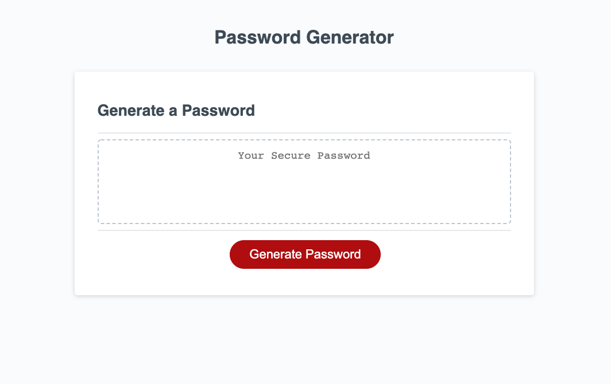

# Password Generator

## Description

This assignment is to produce a professional quality random password generator that may be run from a web page with the following features:

- Password length from 8 to 128 characters
- Can select upper or lowercase characters or both
- Can select numbers
- Can select special characters
- Inputs should be validated
- Password generation is to be initiated with an onscreen button
- The resulting password is to be displayed on the screen above the botton

## Installation

There is no installation required.

## Usage

Applicaton may be run from here: https://melliott7264.github.io/password-generator

Simply load the page at the URL above and click on the Generate Password button.   Follow the prompts to provide the desired password length and the character options.   It is highly recommended that you select both upper and lower case characters as well as special characters and numbers.

Click the Generate Password button again to generate a new password.

  
 
## Credits

Mark Elliott  https://github.com/melliott7264/

Source code for this application: https://github.com/melliott7264/password-generator

The code to display the password and listen for the Generate Password button click were provided as part of this Coding Bootcamp challenge assignment.

## License

Copyright (c) 2022 Mark Elliott

Permission is hereby granted, free of charge, to any person obtaining a copy
of this software and associated documentation files (the "Software"), to deal
in the Software without restriction, including without limitation the rights
to use, copy, modify, merge, publish, distribute, sublicense, and/or sell
copies of the Software, and to permit persons to whom the Software is
furnished to do so, subject to the following conditions:

The above copyright notice and this permission notice shall be included in all
copies or substantial portions of the Software.

THE SOFTWARE IS PROVIDED "AS IS", WITHOUT WARRANTY OF ANY KIND, EXPRESS OR
IMPLIED, INCLUDING BUT NOT LIMITED TO THE WARRANTIES OF MERCHANTABILITY,
FITNESS FOR A PARTICULAR PURPOSE AND NONINFRINGEMENT. IN NO EVENT SHALL THE
AUTHORS OR COPYRIGHT HOLDERS BE LIABLE FOR ANY CLAIM, DAMAGES OR OTHER
LIABILITY, WHETHER IN AN ACTION OF CONTRACT, TORT OR OTHERWISE, ARISING FROM,
OUT OF OR IN CONNECTION WITH THE SOFTWARE OR THE USE OR OTHER DEALINGS IN THE
SOFTWARE.

---
